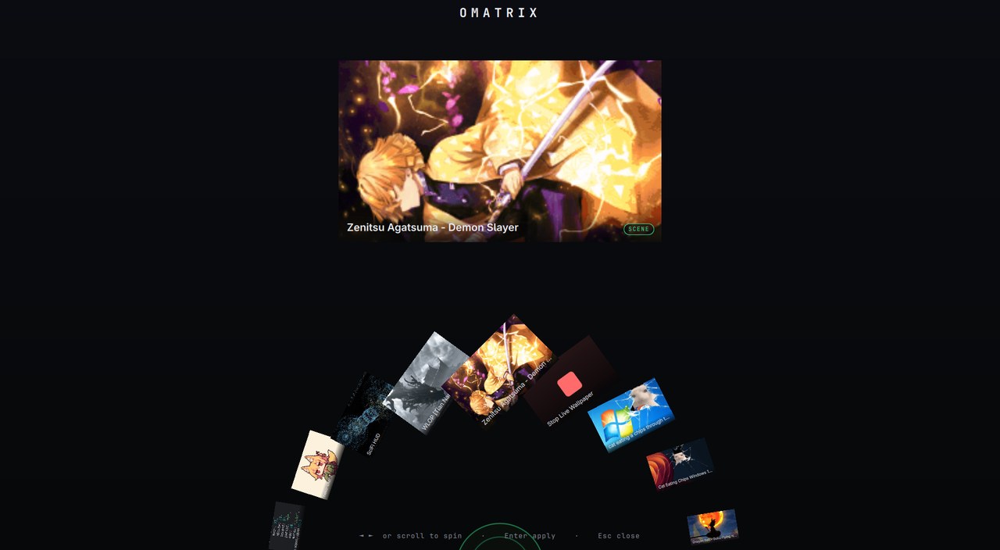

# omarchy-wallpaper-engine

> Simple integration of Omarchy with the official Wallpaper Engine.

Use your **[Wallpaper Engine](https://store.steampowered.com/app/431960/Wallpaper_Engine/)** wallpapers (the animated *scene* and *video* ones from the Steam Workshop) as **live wallpapers on [Omarchy](https://omarchy.org/)**.



Omarchy 4 draws its wallpaper through its Quickshell shell, which only understands static images. This project renders your Wallpaper Engine content on the Hyprland background layer with [`linux-wallpaperengine`](https://github.com/Almamu/linux-wallpaperengine) and gets Omarchy's own background out of the way, so the animation shows through — and survives theme switches and reboots.

https://github.com/Almamu/linux-wallpaperengine does the actual rendering; this repo is the Omarchy glue around it.

---

## Requirements

- An **Omarchy** system (Hyprland + Quickshell shell).
- **Wallpaper Engine** installed via Steam, with some wallpapers subscribed (they live in `~/.local/share/Steam/steamapps/workshop/content/431960/`).
- An AUR helper (`yay` or `paru`) to install `linux-wallpaperengine-git`.

## Install

As an Omarchy plugin:

```bash
yay -S linux-wallpaperengine-git       # the renderer; not installable from a plugin
omarchy plugin add https://github.com/dkgamer02ai/omarchy-wallpaper-engine.git --enable
```

Or from a clone:

```bash
git clone https://github.com/dkgamer02ai/omarchy-wallpaper-engine.git
cd omarchy-wallpaper-engine
./install.sh
```

Either way the setup:
1. installs `linux-wallpaperengine-git` from the AUR (`install.sh` only; skip with `--no-deps`),
2. links the `omarchy-we` CLI into `~/.local/bin`,
3. creates a transparent placeholder so Omarchy's background stops covering the live one,
4. adds an autostart entry to `~/.config/hypr/autostart.lua`,
5. installs an Omarchy `theme-set` hook so the live wallpaper is restored after theme switches,
6. adds **menu > Style > Wallpaper Engine**, which opens the Omatrix dial picker.

`omarchy plugin add` has no post-install hook, so the plugin's `service` entry point
(`Service.qml`) runs `install.sh --no-deps` the first time the shell loads it. Removing the
plugin has no hook either, so run `uninstall.sh` from the plugin folder *before*
`omarchy plugin remove io.github.dkgamer02ai.wallpaper-engine` to clear the autostart entry,
the theme hook, and the menu row. If you forget, the menu row hides itself — it carries a
`when` guard on the `omarchy-we` CLI existing — but the rest is left behind.

## Usage

**menu > Style > Wallpaper Engine** opens **Omatrix**, an Omnitrix-style semicircular dial:
spin it with scroll / arrow keys / drag, and the focused wallpaper drives a large looping
preview. Its last tile, **⏹ Stop Live Wallpaper**, stops the live wallpaper and restores a
normal background. Omatrix needs the plugin install (`omarchy plugin add`); when it can't be
summoned (a plain `./install.sh`, or a non-Omarchy shell) it falls back to the grid picker.
Everything is also available from the CLI:

```bash
omarchy-we list          # list your wallpapers: #  type  title  id
omarchy-we set 3         # set by list number
omarchy-we set 2555206224 # ...or by Steam Workshop id
omarchy-we set "goku"    # ...or by title substring
omarchy-we omatrix       # Omatrix dial overlay (falls back to the grid picker)
omarchy-we menu          # native Omarchy thumbnail-grid picker (falls back to walker/fuzzel/wofi/rofi)
omarchy-we next          # cycle to the next wallpaper
omarchy-we random        # random wallpaper
omarchy-we current       # show what's set and whether it's running
omarchy-we stop          # stop the live wallpaper, restore a normal background
```

Your choice is saved to `~/.local/state/omarchy-we/current` and re-applied on every login.

### Optional: a keybinding

Add to `~/.config/hypr/bindings.lua`:

```lua
o.bind("SUPER + SHIFT + W", "Wallpaper picker", "omarchy-we omatrix")
```

### Tuning

Environment variables (set them before `omarchy-we`, e.g. in the autostart line):

| Variable | Default | Meaning |
|----------|---------|---------|
| `OMARCHY_WE_SCALING` | `fill` | `stretch` \| `fit` \| `fill` \| `default` |
| `OMARCHY_WE_FPS` | *(unset)* | cap the frame rate (e.g. `30`) to save battery |

## How it works

- `linux-wallpaperengine --silent --screen-root <output> --bg <workshop-folder> --scaling fill` renders the wallpaper on the Hyprland **background** layer (one `--screen-root … --bg …` group per active monitor).
- Omarchy's Quickshell background is a fullscreen **opaque** surface on the same layer, so it would hide the live one. We point Omarchy's current background at a **transparent** PNG (`~/.config/omarchy/backgrounds/transparent.png`) — nothing in `/usr/share/omarchy` is ever modified — and relaunch the live wallpaper on top.
- The `theme-set` hook reapplies this after a theme change (which otherwise resets the background and restarts the shell).
- `omarchy-we menu` reuses Omarchy's own Quickshell image selector (`omarchy-menu-images`, the same UI as the built-in background switcher). It builds a thumbnail cache from each wallpaper's `preview.*` image under `~/.cache/omarchy-we/`, with de-duplicated labels mapped back to Steam Workshop IDs. If that isn't present it falls back to a `walker`/`fuzzel`/`wofi`/`rofi` text menu.
- **Omatrix** (`omarchy-we omatrix`) is a Quickshell `overlay` plugin (`DialPicker.qml`) — a semicircular dial of wallpaper cards fed by `omarchy-we ipc entries`, applying via `omarchy-we set`. It only works on the Omarchy shell with the plugin registered; `omarchy-we omatrix` falls back to `omarchy-we menu` otherwise.

## Integration (IPC) for bars & shell plugins

`omarchy-we` exposes a small, stable interface so a status bar or shell can build
its own animated-wallpaper picker on top of it (no need to shell out to the raw
internals). It mirrors the familiar `ipc <verb>` shape:

```bash
omarchy-we ipc version     # JSON capability contract: {"ipc":1,...} (probe before use)
omarchy-we ipc picker      # open the built-in thumbnail picker
omarchy-we ipc entries     # JSON: every wallpaper (for building a custom grid)
omarchy-we ipc current     # JSON: the active wallpaper
omarchy-we ipc set <id>    # apply a wallpaper by Steam Workshop id (or index/title)
omarchy-we ipc stop        # stop the live wallpaper, restore a static background
```

**Capability probe:** integrations should run `omarchy-we ipc version` first and
only enable the feature when it exits 0 and reports a compatible `ipc` contract
(currently `1`). `entries`/`current`/`set` exit non-zero (with a message on stderr)
on failure — treat a non-zero exit as an error, not an empty result. The `ipc`
number is bumped only on a breaking change to these JSON shapes.

`ipc entries` (also `omarchy-we list --json`) returns:

```json
[
  {
    "id": "3239853514",
    "title": "Dragon Ball - Goku Flying Nimbus 4k",
    "type": "scene",
    "preview": "/home/you/.local/share/Steam/steamapps/workshop/content/431960/3239853514/preview.gif",
    "current": false
  }
]
```

`ipc current` (also `omarchy-we current --json`) returns:

```json
{ "id": "3239853514", "title": "…", "type": "scene", "preview": "/…/preview.gif", "running": true }
```

Fields: `id` = Steam Workshop id, `type` = `scene` \| `video` \| `web`, `preview` =
absolute path to the wallpaper's own preview image (build your thumbnails from it) or
`null`, `current`/`running` = booleans. A plugin renders `entries`, and on select calls
`omarchy-we ipc set <id>`. Output is UTF-8 JSON; the contract is considered stable.

## Notes & limits

- **Scene** and **video** wallpapers work. **Web** (HTML/JS) wallpapers may not render — `linux-wallpaperengine`'s web support is limited.
- Live wallpapers use the GPU continuously. On a laptop/iGPU, cap the frame rate (`OMARCHY_WE_FPS=30`) or use `omarchy-we stop` on battery.
- Audio is muted by default (`--silent`).
- Multi-monitor: the wallpaper is rendered on **every** active monitor (one process drives all outputs, re-detected on each `set`/`launch`). The same wallpaper is used on each screen.

## Coexisting with a custom bar / shell

This project never edits third-party shell or bar configs (e.g. a custom Quickshell
bar under `~/.config/quickshell/`). Those are often auto-updating deploys, so editing
them would just cause merge conflicts on the next update. Everything here lives in your
own files: `~/.local/bin`, `~/.config/hypr`, `~/.config/omarchy`, and `~/.cache/omarchy-we`.

If your bar ships its own **static** wallpaper picker, the two coexist happily on
separate keybindings — they just write the same Omarchy background, so **last write wins**:

- Pick a live wallpaper here → the background goes transparent and the animation shows through.
- Pick a **static** image in the other picker → it sets an opaque background that *covers*
  the live wallpaper. The renderer keeps running underneath (using the GPU) until you stop it.

So when you want to return to plain static wallpapers, run **`omarchy-we stop`** once — it
kills the live renderer and restores a normal background. To go back to live, use the
`omarchy-we` picker again.

The keybinding that opens this picker lives in **your** `~/.config/hypr/bindings.lua`, e.g.:

```lua
o.bind("SUPER + SHIFT + W", "Wallpaper picker", "omarchy-we omatrix")
```

## Uninstall

```bash
./uninstall.sh          # removes CLI, hook, autostart, state; restores a normal background
yay -R linux-wallpaperengine-git   # optional: remove the renderer too
```

## Credits

- [Almamu/linux-wallpaperengine](https://github.com/Almamu/linux-wallpaperengine) — the renderer doing all the heavy lifting.
- [Omarchy](https://omarchy.org/) by DHH.
